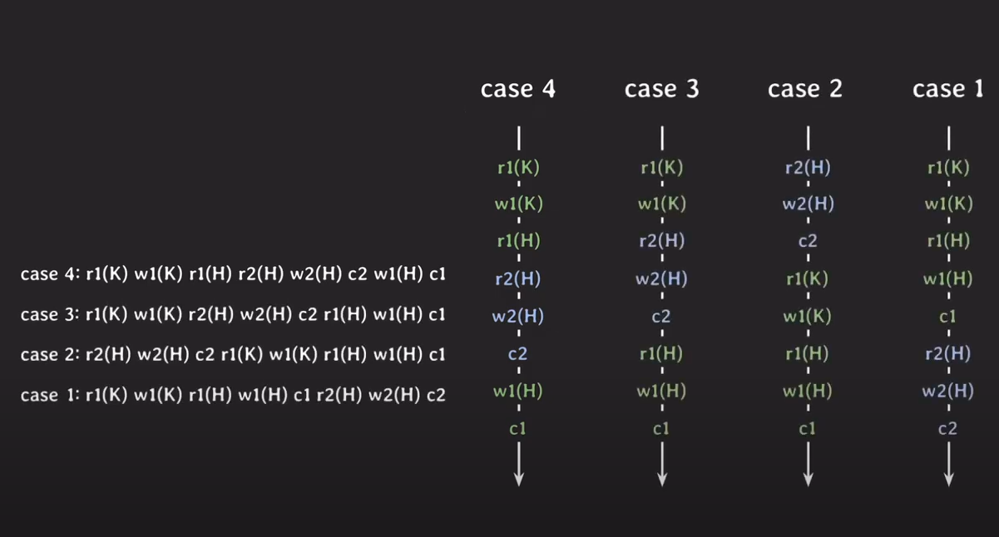

# 트랜잭션

## 트랜잭션

- 단일한 논리적인 작업 단위
- 논리적인 이유로 여러 SQL문들을 단일 작업으로 묶어서 나눠질 수 없게 만든 것이 **트랜잭션**
- 트랜잭션의 SQL문들 중에 일부만 성공해서 DB에 반영되는 일은 일어나지 않는다

### 원자성 Atomicity

- All or Nothing
- 트랜잭션의 SQL문은 전부 처리되거나 취소되어야 한다

### 일관성 Consistency

- 트랜잭션 실행의 결과로 데이터베이스 상태가 모순되지 않아야 한다

### 격리성 Isolation

- 실행 중인 트랜잭션의 중간결과를 다른 트랜잭션이 접근할 수 없다.

### 영속성 Durability

- 트랜잭션이 일단 그 실행을 성공적으로 완료하면 그 결과는 데이터베이스에 영속적으로 저장된다.
- commit된 트랜잭션은 DB에 영구적으로 저장한다.
- DBMS가 보장함 → 개발자가 따로 설정을 해줄 필요 없음

### 스케줄 Schedule

- 여러 transaction들이 동시에 실행될때 각 transaction에 속한 operation의 실행 순서
- 각 transaction 내의 operation들의 순서는 바뀌지 않는다

### Serial schedule

- transaction들이 겹치지 않고 한번에 하나씩 실행되는 schedule
- Nonserial schedule은 그 반대
- 이상한 결과를 만들 가능성 x
- 좋은 성능을 낼 수 없고 현실적으로 사용할 수 없는 방식
- Nonserial schedule은 겹쳐서 실행되기 때문에 동시성이 높아져서 같은 시간 동안 더 많은 트랜잭션을 처리할 수 있다.

> Nonserial로 실행해도 이상한 결과가 나오지 않는 방법 → equivalent
> 

### Conflict of two operations

- 세 가지 조건을 모두 만족하면 conflict
    - 서로 다른 transaction 소속
    - 같은 데이터에 접근
    - 최소 하나는 write operation

스케줄이 동일하다 → Conflict equivalent

### Conflict equivalent for two schedules

- 두 조건 모두 만족하면 Conflict equivalent
    - 두 스케줄은 같은 transaction을 가진다
    - 어떤 conflicting operations의 순서도 양쪽 schedule 모두 동일하다
    

### Conflict serializable

serial schedule와 conflict equivalent일 때

고민거리 : 성능 때문에 nonserial schedule로 만들지만 이상한 결과가 나오지 않았으면 좋겠다

→ conflict serializable한 nonserial schedule을 허용하자!

---

### unrecoverable schedule

schedule 내에서 commit된 transaction이 rollback된 transaction이 write했었던 데이터를 읽은 경우

이전 상태로 회복 불가능 → DBMS가 허락하면 안됨

### recoverable schedule

- 의존성이 발생하면 의존대상이 COMMIT/ROLLBACK 하기전까지는 COMMIT하지 않는다
- 의존성이 일어난 두 트랜잭션을 롤백하는것 → Cascading rollback
- Cascading rollback은 처리비용 많이 듦 → 문제를 어떻게 해결할까?
- 트랜잭션 끝날때마다 commit/rollback 해주면 됨 → cascadeless schedule
- commit되지 않은 transaction들이 write한 데이터는 읽지 않는 경우
- strict schedule

